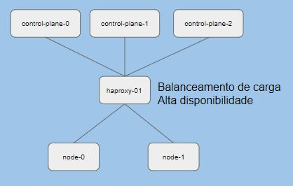

# Alta Disponibilidade No Seu Cluster Kubernetes com HAProxy
O objetivo deste laboratório é mostrar a instalação e configuração básica de um cluster multi Control Plane kubernetes com o HAProxy. Ideal para ambiente on-premise e gerenciado.  
HA significa High Availability. Ou seja, alta disponibilidade.  

Visão do conceito deste laboratório:


Escolhemos a DigitalOcean (DO) para subir a infraestrutura básica utilizando os droplets (máquinas virtuais da DO). As imagens dos droplets foram baseadas em Debian e os IPs privados utilizados para a comunicação dos hosts.  

Dica:
>Considerando este um laboratório, simule o DNS utilizando o arquivo hosts em cada droplet. A princípio, pode ser feito para o *ip-privado-haproxy* + *nome-haproxy*

## TAMANHOS DE MÁQUINAS NA DIGITALOCEAN
Os slugs (*ex. s-1vcpu-1gb*) de droplets podem ser consultados [aqui](https://developers.digitalocean.com/documentation/changelog/api-v2/new-size-slugs-for-droplet-plan-changes/).  


## TERRAFORM
Os passos para o provisionamento dos droplets no DO podem ser vistos em [Como Utilizar Terraform Com DigitalOcean](https://www.digitalocean.com/community/tutorials/how-to-use-terraform-with-digitalocean).

Aqui estão alguns comandos básicos para que sejam executados no diretório do projeto, onde temos os arquivos *.tf*.
Os paths e variáveis estão declarados para uso em sistemas operacionais Windows. Para os baseados em Linux, é só adaptar!

Iniciar o Terraform
```console
terraform init
```

Executar o plano do Terraform
```console
terraform plan -var "do_token=%DO_PAT%" -var "pvt_key=C:\Users\igorw\OneDrive\Documentos\projetos\keys\labs001-privatekey"
```
Deploy com Terraform na DigitalOcean
```console
terraform apply -var "do_token=%DO_PAT%" -var "pvt_key=C:\Users\igorw\OneDrive\Documentos\projetos\keys\labs001-privatekey"
```

Destruir com Terraform droplets na DigitalOcean
```console
terraform destroy -var "do_token=%DO_PAT%" -var "pvt_key=C:\Users\igorw\OneDrive\Documentos\projetos\keys\labs001-privatekey"
```


Caso queira acessar os droplets via SSH a partir do seu computador:
```console
ssh -i <path\you-private-key> <user>@<public-ip>
```
Note que utilizamos a chave privada pois, anteriormente, geramos um par de chaves e cadastramos a pública na DO.  
  
## ARQUITETURA DESTE LABORATÓRIO
Após subirmos a infraestrutura básica e configurarmos o cluster com ha, chegaremos ao seguinte esboço:  



## INSTALAÇÃO DO HAPROXY
[Documentação de Referência](http://www.haproxy.org/#docs)

Instalação do HAProxy
```console
sudo apt-get install haproxy -y
```

Após a instalação, ir no respectivo arquivo de configuração */etc/haproxy/haproxy.cfg* e inserir as entradas abaixo. Após isso, salve o arquivo.

```console
frontend cluster-kubernetes
        mode tcp
        bind 10.108.0.5:6443
        option tcplog
        default_backend control-planes

backend control-planes
        mode tcp
        balance roundrobin
        option tcp-check
        server control-plane-0 10.108.0.3:6443 check fall 2 rise 1
        server control-plane-1 10.108.0.6:6443 check fall 2 rise 1
        server control-plane-2 10.108.0.7:6443 check fall 2 rise 1
```

Reinicie e cheque o status do serviço **haproxy**.
```console
	systemctl restart haproxy
	systemctl status haproxy
```

Você também pode verificar os logs em */var/log/haproxy.log*
  
  

Comandos úteis:  
> **netstat -atunp** --> Para checar as portas no host do HAProxy. Neste nosso caso, verifique se a porta 6443 está presente.   

>**nc -v ip-haproxy 6443** --> Este comando é executado nos demais hosts deste laboratório para validar a conexão com o haproxy na porta 6443. Um excelente comando para troubleshooting.


## INSTALAÇÃO DO [CONTAINERD](https://kubernetes.io/docs/setup/production-environment/container-runtimes/)
[Este vídeo](https://www.youtube.com/watch?v=DXw6NODrIpc) pode te ajudar nesta instalação.  

Precisamos de um container runtime e, neste caso, escolhemos o containerd (poderia ser [CRI-O](https://cri-o.io/) ou outro).  

Basicamente ele baixa, executa e extrai qualquer imagem que seja compatível com a [OCI](https://opencontainers.org/). Além de executar processos do runC.

>Executar os passos abaixo em cada Control Plane e Nó.

PRÉ-INSTALAÇÃO  

```console
cat <<EOF | sudo tee /etc/modules-load.d/containerd.conf
overlay
br_netfilter
EOF

sudo modprobe overlay
sudo modprobe br_netfilter

# Configurações requeridas no sysctl, estas persistem após reiniciar o host.
cat <<EOF | sudo tee /etc/sysctl.d/99-kubernetes-cri.conf
net.bridge.bridge-nf-call-iptables  = 1
net.ipv4.ip_forward                 = 1
net.bridge.bridge-nf-call-ip6tables = 1
EOF

# Aplicar as configurações no sysctl sem a necessidade de reiniciar o host
sudo sysctl --system
```

INSTALAÇÃO  

```console
sudo apt-get install containerd -y
	
sudo mkdir -p /etc/containerd
containerd config default | sudo tee /etc/containerd/config.toml

sudo systemctl restart containerd
```


## [INSTALAÇÃO KUBELET KUBEADM KUBECTL](https://kubernetes.io/docs/setup/production-environment/tools/kubeadm/install-kubeadm/)

Essa trinca (kubelet, kubeadm e kubectl) é necessária para podermos levantar o nosso cluster kubernetes Multi Control Plane!

PRÉ-INSTALAÇÃO  

Verifique se o módulo ***br_netfilter*** está carregado. Isso pode ser feito da seguinte forma:

```console
lsmod | grep br_netfilter
```

Caso não encontre, carregue-o da seguinte forma:
```console
sudo modprobe br_netfilter
```
As configurações dos nós linux no que se refere ao iptables precisam estar corretas para que a comunicação do cluster funcione. O ***net.bridge.bridge-nf-call-iptables*** tem que estar igual a 1 na configuração do ***sysctl***. 

```console
cat <<EOF | sudo tee /etc/modules-load.d/k8s.conf
br_netfilter
EOF

cat <<EOF | sudo tee /etc/sysctl.d/k8s.conf
net.bridge.bridge-nf-call-ip6tables = 1
net.bridge.bridge-nf-call-iptables = 1
EOF

sudo sysctl --system
```  

INSTALAÇÃO  

Atualize a indexação/lista de pacotes e instale os pacotes necessários para poder utilizar o repositório do kubernetes:

```console
sudo apt-get update
sudo apt-get install -y apt-transport-https ca-certificates curl
```  

Baixe a chave de assinatura pública do Google Cloud:
```console
sudo curl -fsSLo /usr/share/keyrings/kubernetes-archive-keyring.gpg https://packages.cloud.google.com/apt/doc/apt-key.gpg
```

Adicione o repositório do kubernetes:
```console
echo "deb [signed-by=/usr/share/keyrings/kubernetes-archive-keyring.gpg] https://apt.kubernetes.io/ kubernetes-xenial main" | sudo tee /etc/apt/sources.list.d/kubernetes.list
```
Atualize a indexação/lista de pacotes e instale a trinca kubelet, kubeadm e kubectl. Ao final, fixe a versão instalada com o ***hold*** ;)
```console
sudo apt-get update
sudo apt-get install -y kubelet kubeadm kubectl
sudo apt-mark hold kubelet kubeadm kubectl
```

## [INICIANDO SEU CLUSTER KUBERNETES HA](https://kubernetes.io/docs/setup/production-environment/tools/kubeadm/high-availability/)

Escolha somente um Control Plane para executar:
```console
sudo kubeadm init --control-plane-endpoint "haproxy-ip:6443" --upload-certs
```
Pronto! Isso irá iniciar o seu Cluster Kubernetes Multi Control Plane pois o ***--control-plane-endpoint*** é o IP interno do nosso HAProxy. Poderia ser o Virtual IP (VIP) do HAProxy caso tivéssemos mais de um com keep-alive.

Ao final, você terá os comandos para gerenciar o seu cluster e colocar os demais Control Planes e Nós (workers) no cluster.  

Exemplo:

>To start using your cluster, you need to run the following as a regular user:
>
>  mkdir -p $HOME/.kube
>  sudo cp -i /etc/kubernetes/admin.conf $HOME/.kube/config
>  sudo chown $(id -u):$(id -g) $HOME/.kube/config
>
>Alternatively, if you are the root user, you can run:
>
>  export KUBECONFIG=/etc/kubernetes/admin.conf
>
>You should now deploy a pod network to the cluster.
>Run "kubectl apply -f [podnetwork].yaml" with one of the options listed at:
>  https://kubernetes.io/docs/concepts/cluster-administration/addons/
>
>You can now join **any number of the control-plane node** running the following command on each as root:
>
>  kubeadm join haproxy-01:6443 --token 42i35p.wgxvowimiy4ub9mp \
>        --discovery-token-ca-cert-hash sha256:20a5adc8095fd25cf2d9a72cc89362818c8dbb7ac37b4461900526ae65ba99e5 \
>        --control-plane --certificate-key 018a256e7ff705be89224231e184f6cee8bdf019fec1d72780da8f3d78db2685
>
>Please note that the certificate-key gives access to cluster sensitive data, keep it secret!
>As a safeguard, uploaded-certs will be deleted in two hours; If necessary, you can use
>"kubeadm init phase upload-certs --upload-certs" to reload certs afterward.
>
>Then you can join any number of worker nodes by running the following on each as root:
>
>kubeadm join haproxy-01:6443 --token 42i35p.wgxvowimiy4ub9mp \
>        --discovery-token-ca-cert-hash sha256:20a5adc8095fd25cf2d9a72cc89362818c8dbb7ac37b4461900526ae65ba99e5

Instale um plugin referente ao Container Network Interface (CNI). Neste caso, vamos instalar o Weave Net:
```console
kubectl apply -f "https://cloud.weave.works/k8s/net?k8s-version=$(kubectl version | base64 | tr -d '\n')"
```

Agora sim você pode ver os componentes do Control Plane inicializando:
```console
kubectl get pod -n kube-system -w
```

## APROVEITE O SEU CLUSTER

Que tal através do Control Plane criar ou escalar um Pod?!
```console
kubect create deployment nginx --image nginx
kubectl scale deployment nginx --replicas 5
```

Pause ou desligue um Control Plane e veja se ainda conseguirá gerenciar os recursos do seu cluster ;)
